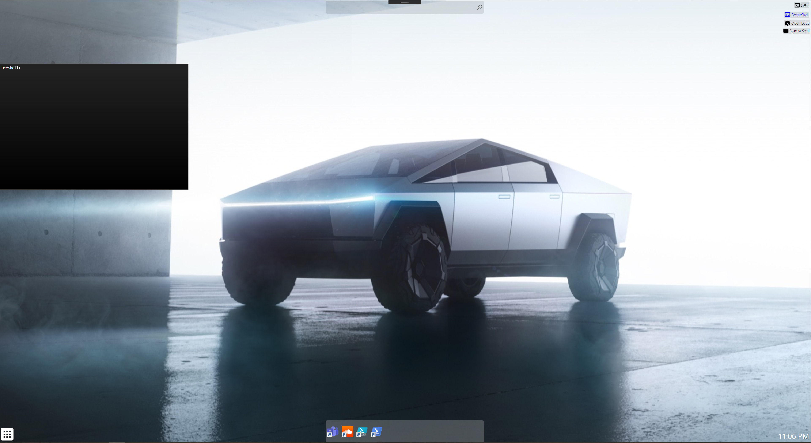

# DevShell

DevShell is an open source custom shell for windows written in C#. **This project is in the early stages so documentation will be lacking in many areas.** 

The Core library is a .NET Standard 2.0 library so in theory it could be using on other platforms. However, the current implementation (source of the screenshot above) is written in WPF for .NET Core. I'm not familiar with setting the Shell in Linux or on Mac OS but if someone wants to create a pull request feel free. This also goes for Android, I would assume a custom launcher can't be set for IOS but I could be wrong. 

## Motivation

The default Windows shell is Windows Explorer.  I think a number of updates can be made to improve the functionality of the current shell so I'm working on this project to test that theory.  

The main goal is to create an open source extensible shell for windows. Well the default shell supports extensions I think having a default C# interface for interacting with various portions of the desktop could provide improve could quality and interop. 

Overall I just find myself struggling to navigate the File Explorer in many cases where it should be easy and I have a few ideas on how I can improve that for my experience. I'm tossing the code on GitHub for the versioning support and a spot to store it. If anyone else finds themselves in the same position this could may be useful but a heads up it's as is.

## Getting Started

*Currently there is only information on contributing to the repo and not using the shell in other projects.*

Once you've cloned the repo running the project can be accomplished within a few steps. Because the shell is just a graphical program it can be debugged like a regular WPF application. Make sure to restore the NuGet packages either by command line or by the NuGet package manager and then run the debugger.  You will get a window popping up showing what the desktop would appear like full screen if used as the shell. 

### Setting a Custom Shell

I recommend creating a specific test account on your PC for this. A custom shell can be set per-account so it's best to have an account to test on. Additionally you can also "Bail Out" to the default shell by clicking *System Shell* in the top right corner (or the x to close if you're debugging). I'm going to assume you are familiar with creating a user account and will suggest searching the internet for this information as it is readily available.

#### 1. Enable Custom Shell Support

Using a Custom Shell is not common for non-business users (in my experience) and it's mainly used in businesses for locking down kiosks. As such you will need to enable a windows feature in the control panel  `Device Lockdown > Shell Launcher`.  

#### 2. Create a Directory for the DevShell

I don't currently have an installer for the DevShell so you will need to manually create a folder for the shell files to exist. I recommend using `C:\DevShell`. 

#### 3. Run a Build and copy the files

Run either a Debug or Release build of DevShell and copy the output of the build into the DevShell folder you made in step two. You will need to set the following registry key on the test account you created to enable DevShell as the default shell:

`HKEY_CURRENT_USER\Software\Policies\Microsoft\Windows\CurrentVersion\Policies\System`

You may need to create the last System key if it does not already exist. 

Then set/create the following string value:

`Shell` to `C:\<installFolder>\DevShell.exe` where `installFolder` is the location of the DevShell files you copied.

#### 4. Restart your PC

Restart your PC to apply the changes. Remove or replace the value with explorer.exe to reset to default.

